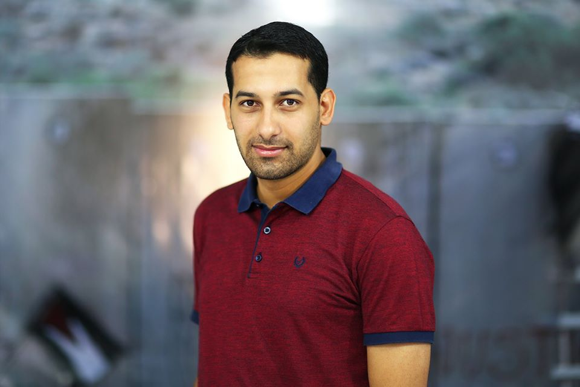

# Abdallah Safi
Computer Engineer

## About me
I am Abdallah, a computer engineer, from Gaza. As of now, I work as a web developer but I once worked as math teacher and also as a journalist for a media agency.
I know that's a bit weird, but I don't mind weirdness because I enjoy discovering new things all the time. It's a hobby to me. On another note, I really love to read.  I also like to write sometimes because I know that words are powerful in a magical way. My dream is not big and it's not small, either. I dream of making good impact on myself and every one I encounter. Well, if you read this far, then you know almost the most important things about me.

## Hobbies & Interests
- l like Reading 
- Writing
- Graphic Design 
- Writing in Arabic calligraphy

## Favorite Music
Mozart, beethoven, Adele and Maher Zain songs

## Favorite Movies
The Pursuit of Happyness (2006), The Hurricane (1999), Harry Potter

## Favorite Books
"Tipping point" by malcolm gladwell, "Harry Potter" by J.K. Rowling

## Favorite Quotes
>"If there's even a slight chance at getting something that will make you happy, RISK IT.
life's too short and happiness is too rare"
>by A.R. Lucas
